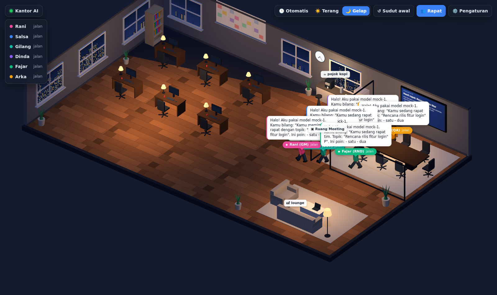

# 🏢 Virtual AI Office

Kantor virtual 3D isometrik yang ringan dan jalan di browser, untuk agen-agen AI kamu. Tiap agen punya meja, status, dan kepribadian sendiri. Agen bisa diajak chat satu-satu atau disuruh **rapat bareng**. Backend-nya bisa **API OpenAI-compatible** apa saja: 9router, OpenAI/ChatGPT, OpenRouter, Ollama, LM Studio, vLLM, dll.



## Kenapa ringan

- **Tanpa build step dan tanpa framework frontend.** Pakai ES modules biasa plus [three.js](https://threejs.org) (dependency satu-satunya).
- **Server Node tanpa dependency** (`server.js`, sekitar 250 baris). Tugasnya menyajikan file statis dan jadi proxy ke provider LLM.
- Tidak ada model 3D atau gambar yang perlu diunduh. Semua furnitur dan karakter dibuat dari primitive low-poly, dan tekstur (lantai, jendela kota, kanban, jam, TV) digambar lewat canvas.
- Satu lampu bayangan, material Lambert, dan pixel ratio maksimal 1.5, jadi tetap enak di laptop kentang.

## Fitur

- Kantor 3D isometrik: meja kerja, ruang meeting berdinding kaca dengan TV laporan, pojok kopi, lounge, jendela kota, dan jam yang menunjukkan waktu asli.
- Tema **Otomatis / Terang / Gelap**. Mode otomatis ikut jam lokal, dan lampu meja menyala di malam hari.
- Agen **jalan** memakai pathfinding A*, lalu duduk atau berdiri sesuai tempatnya. Saat idle kadang mereka ngopi atau santai di lounge.
- Status live di atas kepala (`lagi kerja`, `lagi mikir…`, `lagi ngetik…`, `lagi rapat`, `ngopi`) dan balon teks yang ikut streaming.
- **Chat 1-on-1** dengan respons streaming dan tampilan markdown. Riwayat chat disimpan di browser.
- **Rapat multi-agen**: peserta berjalan ke ruang meeting, bicara bergiliran selama beberapa putaran, lalu pemimpin rapat menulis kesimpulan (keputusan, tugas per orang, risiko). Kesimpulan itu tampil di TV dan tersimpan di riwayat chat pemimpin rapat.
- **Pengaturan di UI**: tambah/ubah provider dan agen (nama, peran, warna, model, system prompt), plus tombol "Ambil model" untuk melihat model yang tersedia.
- API key hanya ada di server. Browser tidak pernah menerima key.

## Cara jalan

Butuh Node.js 18 atau lebih baru.

```bash
npm install
cp .env.example .env     # isi API key yang dipakai
npm start                # buka http://127.0.0.1:3000
```

Saat pertama kali jalan, `data/office.json` dibuat dari `data/office.example.json`. File ini tidak masuk git, dan semua perubahan dari menu ⚙️ Pengaturan disimpan di sini.

### Menghubungkan provider

| Provider | Base URL | Catatan |
|---|---|---|
| 9router | `http://localhost:20128/v1` | Jalankan 9router dulu. Isi `NINEROUTER_API_KEY` kalau 9router kamu memakai key. |
| OpenAI / ChatGPT | `https://api.openai.com/v1` | `OPENAI_API_KEY` |
| OpenRouter | `https://openrouter.ai/api/v1` | `OPENROUTER_API_KEY` |
| Ollama | `http://localhost:11434/v1` | Tanpa key |
| LM Studio | `http://localhost:1234/v1` | Tanpa key |

Setiap agen boleh memakai provider dan model yang berbeda. Contohnya, GM pakai GPT dan developer pakai model coding lewat 9router. Kalau kolom model agen dikosongkan, agen memakai model default provider-nya.

### Akses dari HP / jaringan lain

Secara default server hanya listen di `127.0.0.1`. Untuk membukanya ke LAN, set `HOST=0.0.0.0` **dan** isi `OFFICE_PASSWORD` di `.env`, karena siapa pun yang bisa membuka halaman ini bisa memakai kuota API kamu.

## Kontrol

- **Drag kiri** untuk geser, **scroll** untuk zoom, **drag kanan** untuk memutar sudut kamera.
- Klik karakter, label namanya, atau nama di daftar kiri untuk membuka chat.
- **👥 Rapat** untuk memilih topik, peserta, dan jumlah putaran.

## Struktur

```
server.js              server statis + proxy /api/chat (SSE), /api/models, /api/config
data/office.example.json  config awal (provider & agen)
public/index.html
public/css/style.css
public/js/
  main.js              UI: tema, daftar agen, panel chat, rapat
  world.js             scene three.js: ruangan, furnitur, lampu, grid navigasi A*
  agent.js             karakter low-poly, animasi, label & balon teks
  office.js            "sutradara": perilaku idle, chat, alur rapat
  settings.js          dialog pengaturan
  api.js               klien API + parser streaming SSE
  markdown.js          renderer markdown mini (aman dari XSS)
```

## API server

- `GET /api/config`: mengembalikan config tanpa API key (ada flag `hasKey`).
- `PUT /api/config`: menyimpan config. Kalau `apiKey` dikosongkan, key lama tetap dipakai.
- `POST /api/chat` dengan body `{ agentId, messages }`: system prompt agen ditambahkan di server, lalu hasilnya di-stream balik dalam format SSE OpenAI.
- `GET /api/models?provider=<id>`: meneruskan request ke `GET {baseUrl}/models`.

## Ide pengembangan

- Tool calling (misalnya agen bisa membaca/menulis file atau memanggil webhook) dan delegasi tugas antar-agen.
- Papan kanban yang benar-benar terisi dari tugas hasil rapat.
- Riwayat & ekspor notulen rapat.
