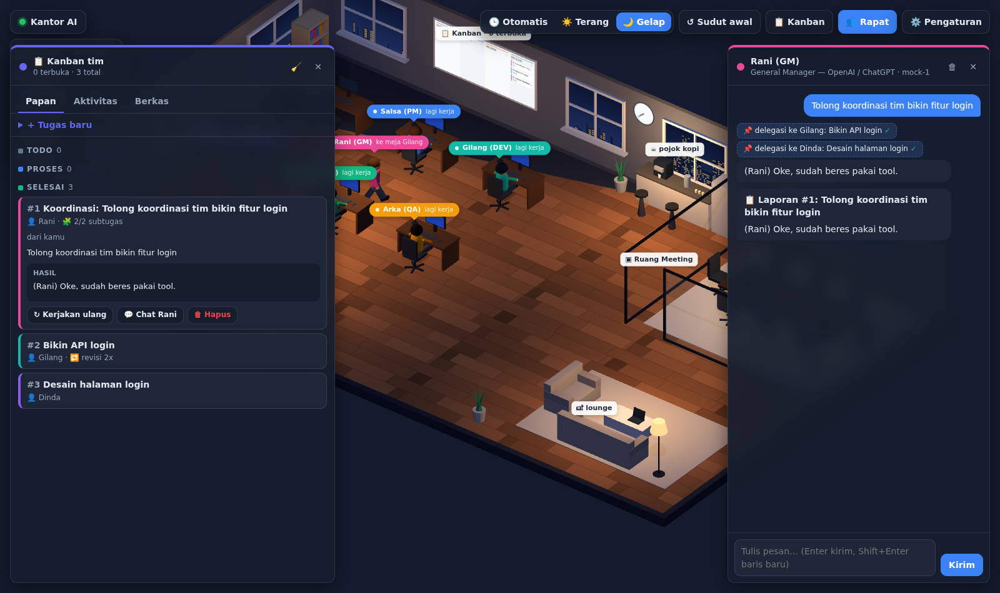

# 🏢 Virtual AI Office

Kantor virtual 3D isometrik yang ringan dan jalan di browser, untuk agen-agen AI kamu. Tiap agen punya meja, status, dan kepribadian sendiri. Agen bisa diajak chat satu-satu, disuruh **rapat bareng**, dan **berkoordinasi sebagai tim** lewat tool calling dan papan kanban bersama. Backend-nya bisa **API OpenAI-compatible** apa saja: 9router, OpenAI/ChatGPT, OpenRouter, Ollama, LM Studio, vLLM, dll.


## Koordinasi tim (tool calling + kanban)



Setiap agen bisa memanggil **tools** (format function calling OpenAI):

| Tool | Fungsi |
|---|---|
| `create_task` | Mendelegasikan pekerjaan ke rekan sebagai kartu kanban baru |
| `ask_agent` | Bertanya langsung ke rekan dan menunggu jawabannya |
| `update_task` | Memindahkan kartu, menambah catatan, atau meminta revisi (`status: "todo"` + feedback) |
| `list_tasks` / `get_task` | Melihat isi papan kanban / detail lengkap satu kartu (termasuk hasil kerja rekan) |
| `write_file` / `read_file` / `list_files` | Menulis dan membaca dokumen/kode di workspace bersama `data/workspace/` |
| `fetch_url` | Membuka halaman web publik (opsional, aktif kalau `TOOLS_HTTP=1`) |

Contoh alurnya, saat kamu menulis ke Rani (GM): *"Tolong koordinasikan tim bikin fitur login"*:

1. Rani memanggil `create_task` untuk Gilang (API) dan Dinda (desain). Di layar, Rani berjalan ke meja masing-masing.
2. **Dispatcher** di server langsung menjalankan kartu yang sudah ada penanggung jawabnya. Gilang dan Dinda bekerja paralel. Kalau perlu, mereka saling bertanya (`ask_agent`) dan menyimpan hasil ke file.
3. Kartu yang dibuat oleh agen masuk kolom **Review**. Setelah semua subtugas selesai, Rani dipanggil lagi untuk memeriksa hasilnya. Ia bisa meminta revisi (maksimal 2x per kartu) atau menerimanya.
4. Rani menulis **laporan akhir**. Laporan ini masuk ke riwayat chat kamu dengan Rani, dan kartunya pindah ke **Selesai**.

Cara lain memberi tugas:
- **📋 Kanban → + Tugas baru**: buat kartu dan pilih agennya. Agen itu langsung mengerjakannya (dan boleh mendelegasikan bagiannya).
- **👥 Rapat**: centang *"pemimpin membagi TUGAS ke kanban"*. Setelah rapat selesai, poin-poin TUGAS di kesimpulan otomatis jadi kartu dan langsung dikerjakan.

Panel Kanban punya tiga tab: **Papan** (kartu per kolom, hasil, catatan, tombol jalankan ulang, dan ⏹ **Hentikan** untuk kartu yang sedang dikerjakan beserta subtugasnya), **Aktivitas** (feed live siapa melakukan apa), dan **Berkas** (isi workspace, bisa diunduh). Laporan yang selesai saat browser tertutup tetap masuk ke chat begitu halaman dibuka lagi. Papan kanban di dinding kantor 3D juga ikut update secara live.

Pengaman supaya agen tidak berputar-putar:
- Delegasi maksimal 2 tingkat.
- Saat memeriksa hasil, agen tidak boleh mendelegasikan ulang.
- Kartu duplikat ditolak.
- Maksimal 8 langkah tool per sekali jalan dan 5 eksekusi per kartu.
- Tidak boleh mendelegasikan balik ke pemberi tugas.

Model yang tidak mendukung tool calling tetap bisa dipakai. Matikan opsi "Tool calling" di provider tersebut, atau biarkan: server otomatis mencoba lagi tanpa tools kalau provider menolaknya. Opsi "Jalankan tugas otomatis" di Pengaturan bisa dimatikan kalau kamu ingin memulai setiap kartu secara manual.

## Kenapa ringan

- **Tanpa build step dan tanpa framework frontend.** Pakai ES modules biasa plus [three.js](https://threejs.org) (dependency satu-satunya).
- **Server Node tanpa dependency** (`server.js` + `lib/`). Tugasnya menyajikan file statis, jadi proxy ke provider LLM, dan menjalankan agen dengan tools. State kanban disimpan di satu file JSON.
- Tidak ada model 3D atau gambar yang perlu diunduh. Semua furnitur dan karakter dibuat dari primitive low-poly, dan tekstur (lantai, jendela kota, kanban, jam, TV) digambar lewat canvas.
- Satu lampu bayangan, material Lambert, dan pixel ratio maksimal 1.5, jadi tetap enak di laptop kentang.

## Fitur

- Kantor 3D isometrik: meja kerja, ruang meeting berdinding kaca dengan TV laporan, pojok kopi, lounge, jendela kota, dan jam yang menunjukkan waktu asli.
- Tema **Otomatis / Terang / Gelap**. Mode otomatis ikut jam lokal, dan lampu meja menyala di malam hari.
- Agen **jalan** memakai pathfinding A*, lalu duduk atau berdiri sesuai tempatnya. Saat idle kadang mereka ngopi atau santai di lounge.
- Status live di atas kepala (`lagi kerja`, `lagi mikir…`, `lagi ngetik…`, `lagi rapat`, `ngopi`) dan balon teks yang ikut streaming.
- **Chat 1-on-1** dengan respons streaming dan tampilan markdown. Riwayat chat disimpan di browser.
- **Rapat multi-agen**: peserta berjalan ke ruang meeting, bicara bergiliran selama beberapa putaran, lalu pemimpin rapat menulis kesimpulan (keputusan, tugas per orang, risiko). Kesimpulan itu tampil di TV dan tersimpan di riwayat chat pemimpin rapat.
- **Pengaturan di UI**: tambah/ubah provider dan agen (nama, peran, warna, model, system prompt), plus tombol "Ambil model" untuk melihat model yang tersedia.
- API key hanya ada di server. Browser tidak pernah menerima key.

## Cara jalan

Butuh Node.js 18 atau lebih baru.

```bash
npm install
cp .env.example .env     # isi API key yang dipakai
npm start                # buka http://127.0.0.1:3000
```

### Ganti port

Pakai salah satu cara berikut (yang paling atas paling diprioritaskan):

```bash
npm start -- --port 8080          # argumen CLI
PORT=8080 npm start               # variabel lingkungan (Linux/macOS)
set PORT=8080 && npm start        # Windows CMD
$env:PORT=8080; npm start         # Windows PowerShell
```

Atau tulis `PORT=8080` di `.env` supaya permanen. Kalau port sudah dipakai program lain, server otomatis mencoba port berikutnya (misalnya 8081) dan menampilkan alamat yang dipakai di terminal.

Saat pertama kali jalan, `data/office.json` dibuat dari `data/office.example.json`. File ini tidak masuk git, dan semua perubahan dari menu ⚙️ Pengaturan disimpan di sini.

### Menghubungkan provider

| Provider | Base URL | Catatan |
|---|---|---|
| 9router | `http://localhost:20128/v1` | Jalankan 9router dulu. Isi `NINEROUTER_API_KEY` kalau 9router kamu memakai key. |
| OpenAI / ChatGPT | `https://api.openai.com/v1` | `OPENAI_API_KEY` |
| OpenRouter | `https://openrouter.ai/api/v1` | `OPENROUTER_API_KEY` |
| Ollama | `http://localhost:11434/v1` | Tanpa key |
| LM Studio | `http://localhost:1234/v1` | Tanpa key |

Setiap agen boleh memakai provider dan model yang berbeda. Contohnya, GM pakai GPT dan developer pakai model coding lewat 9router. Kalau kolom model agen dikosongkan, agen memakai model default provider-nya.

### Akses dari HP / jaringan lain

Secara default server hanya listen di `127.0.0.1`. Untuk membukanya ke LAN, set `HOST=0.0.0.0` (atau `npm start -- --host 0.0.0.0`) **dan** isi `OFFICE_PASSWORD` di `.env`, karena siapa pun yang bisa membuka halaman ini bisa memakai kuota API kamu.

### Variabel `.env` lain

| Variabel | Default | Fungsi |
|---|---|---|
| `DATA_DIR` | `./data` | Lokasi config, kanban, dan workspace |
| `LLM_IDLE_TIMEOUT_MS` | `120000` | Request dibatalkan kalau provider diam selama ini |
| `TOOLS_HTTP` | `0` | `1` untuk mengaktifkan tool `fetch_url` |

Request ke provider otomatis diulang sampai 2x kalau kena 429/5xx atau koneksi putus.

## Tes

```bash
npm test     # tes end-to-end dengan mock LLM (tanpa API key)
npm run check
```

Tes ini menjalankan server asli dan memeriksa: alur koordinasi (delegasi → kerja paralel → review → laporan), menghentikan kartu, fallback untuk provider tanpa tools, retry saat kena 429, keamanan path workspace, dan perpindahan port otomatis saat port bentrok.

## Kontrol

- **Drag kiri** untuk geser, **scroll** untuk zoom, **drag kanan** untuk memutar sudut kamera.
- Klik karakter, label namanya, atau nama di daftar kiri untuk membuka chat.
- **👥 Rapat** untuk memilih topik, peserta, dan jumlah putaran.

## Struktur

```
server.js              server statis + routing API
lib/
  agents.js            loop agen + tool calling, dispatcher tugas kanban
  llm.js               panggilan OpenAI-compatible (streaming teks + tool calls)
  board.js             papan kanban (data/board.json)
  bus.js               event live ke browser (SSE)
  workspace.js         file bersama agen (data/workspace/)
  config.js            config provider & agen
data/office.example.json  config awal (provider & agen)
public/index.html
public/css/style.css
public/js/
  main.js              UI: tema, daftar agen, panel chat, rapat
  boardui.js           panel kanban: papan, aktivitas, berkas
  world.js             scene three.js: ruangan, furnitur, lampu, grid navigasi A*
  agent.js             karakter low-poly, animasi, label & balon teks
  office.js            "sutradara": perilaku idle, chat, alur rapat
  settings.js          dialog pengaturan
  api.js               klien API + parser streaming SSE
  markdown.js          renderer markdown mini (aman dari XSS)
```

## API server

- `GET /api/config`: mengembalikan config tanpa API key (ada flag `hasKey`).
- `PUT /api/config`: menyimpan config. Kalau `apiKey` dikosongkan, key lama tetap dipakai.
- `POST /api/agent` dengan body `{ agentId, messages }`: agen dijalankan dengan tools. Balasannya berupa SSE `delta`, `tool`, `tool_result`, lalu `done`.
- `POST /api/chat` dengan body `{ agentId, messages }`: chat polos tanpa tools (dipakai untuk giliran bicara saat rapat), di-stream dalam format SSE OpenAI.
- `GET /api/events`: stream SSE berisi status agen, isi kanban, handoff antar agen, log aktivitas, dan laporan.
- `GET/POST /api/tasks`, `PATCH/DELETE /api/tasks/:id`, `POST /api/tasks/clear-done`: mengelola kartu kanban.
- `GET /api/files[?path=]`: daftar berkas workspace, atau isi satu berkas.
- `GET /api/models?provider=<id>`: meneruskan request ke `GET {baseUrl}/models`.

## Ide pengembangan

- Tool tambahan: webhook, eksekusi kode di sandbox, dan integrasi MCP.
- Riwayat & ekspor notulen rapat.
- Memori jangka panjang per agen.
